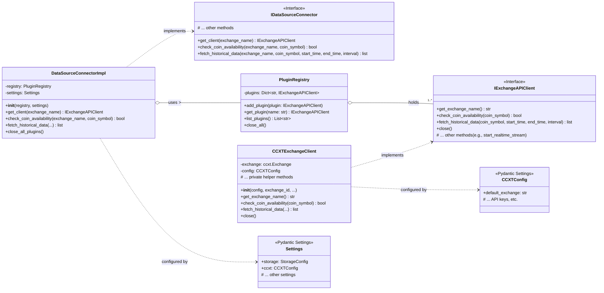
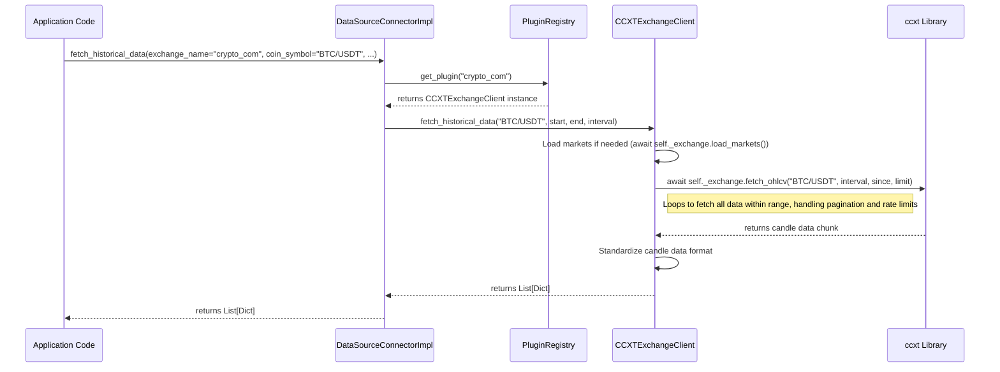

# Exchange Source Package Documentation

This document outlines the functionality and design of the `exchange_source` package (`src/exchange_source`) within the `cb-trade-data-service`.

## 1. Purpose

The `src/exchange_source` package provides a unified interface for interacting with various cryptocurrency exchanges. Its primary goal is to abstract the specific details of different exchange APIs (like CCXT) and offer a consistent way to:

*   Fetch historical market data (e.g., OHLCV).
*   Check the availability of specific trading pairs (coins) on an exchange.
*   (Potentially) Stream real-time market data (though the current implementation notes this as not fully implemented for async).

It employs a plugin-based architecture to allow easy addition or modification of support for different exchanges.

## 2. Design: Plugin-Based Microkernel

The package uses a microkernel pattern centered around a plugin registry:

1.  **`IExchangeAPIClient` (Interface)**: Defined in `interfaces.py`, this interface specifies the contract that any individual exchange client plugin must adhere to. It includes methods like `get_exchange_name`, `fetch_historical_data`, `check_coin_availability`, and `close`.
2.  **Concrete Plugins (e.g., `CCXTExchangeClient`)**: Located in the `plugins/` subdirectory (e.g., `plugins/ccxt_exchange.py`). These classes implement `IExchangeAPIClient` for a specific exchange or library (like CCXT). They handle the actual communication with the exchange's API.
3.  **`PluginRegistry`**: Defined in `microkernel.py`, this class acts as a container for instantiated exchange client plugins. It allows adding, retrieving by name, listing, and closing plugins.
4.  **`IDataSourceConnector` (Interface)**: Defined in `interfaces.py`, this interface acts as a high-level facade for accessing exchange data. Application code primarily interacts with this interface.
5.  **`DataSourceConnectorImpl` (Implementation)**: Defined in `microkernel.py`, this class implements `IDataSourceConnector`. It holds an instance of the `PluginRegistry` and delegates calls (`get_client`, `check_coin_availability`, `fetch_historical_data`, etc.) to the appropriate registered plugin based on the requested `exchange_name`.
6.  **Configuration (`src/config.py`, `src/storage/config.py`)**: Configuration objects (like `Settings` and `CCXTConfig` using Pydantic `BaseSettings`) provide necessary parameters (e.g., default exchange, API keys if needed) for instantiating and configuring the plugins and the connector.

## 3. Key Components

*   **`interfaces.py`**: Defines the core abstractions `IExchangeAPIClient` and `IDataSourceConnector`.
*   **`microkernel.py`**: Contains the `PluginRegistry` for managing plugins and the `DataSourceConnectorImpl` which orchestrates access to the plugins.
*   **`plugins/`**: Directory containing concrete implementations of `IExchangeAPIClient`.
    *   `ccxt_exchange.py`: Implements `IExchangeAPIClient` using the `ccxt` library, allowing connection to many exchanges supported by CCXT.
*   **`src/config.py`**: Contains Pydantic settings models (`Settings`, `CCXTConfig`) used to configure the exchange clients and connector, often loaded from environment variables or `.env` files.

## 4. Diagrams

### Class Diagram (`src/exchange_source`)

### Sequence Diagram (Fetching Historical Data via CCXT Plugin)

## 5. Configuration

- The `DataSourceConnectorImpl` and specific plugins like `CCXTExchangeClient` rely on configuration provided via the `Settings` object (defined in `src/config.py`).
- `CCXTConfig` specifically holds settings relevant to the CCXT library, such as the `default_exchange`. API keys can also be added here if required for private endpoints.
- Settings are typically loaded from environment variables or a `.env` file using `pydantic-settings`.

## 6. Usage

Application components (like the `historical` data fetcher) would typically interact with an instance of `IDataSourceConnector` (likely `DataSourceConnectorImpl`) injected via dependency injection. They would call methods like `fetch_historical_data`, specifying the desired exchange name and other parameters. The connector then routes the request to the correct plugin.
