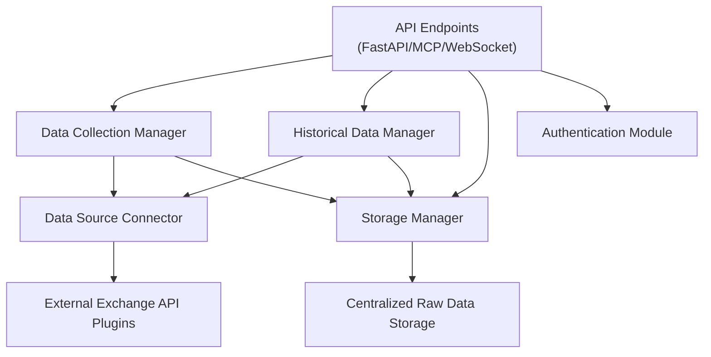
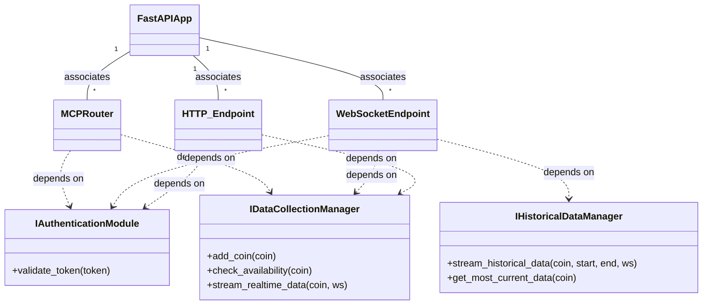
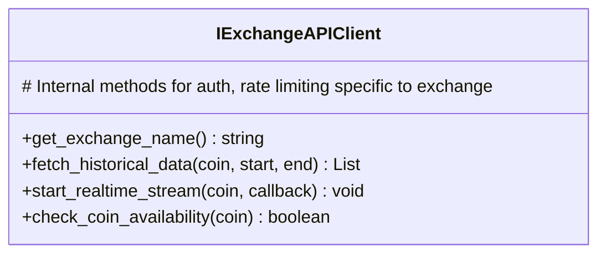
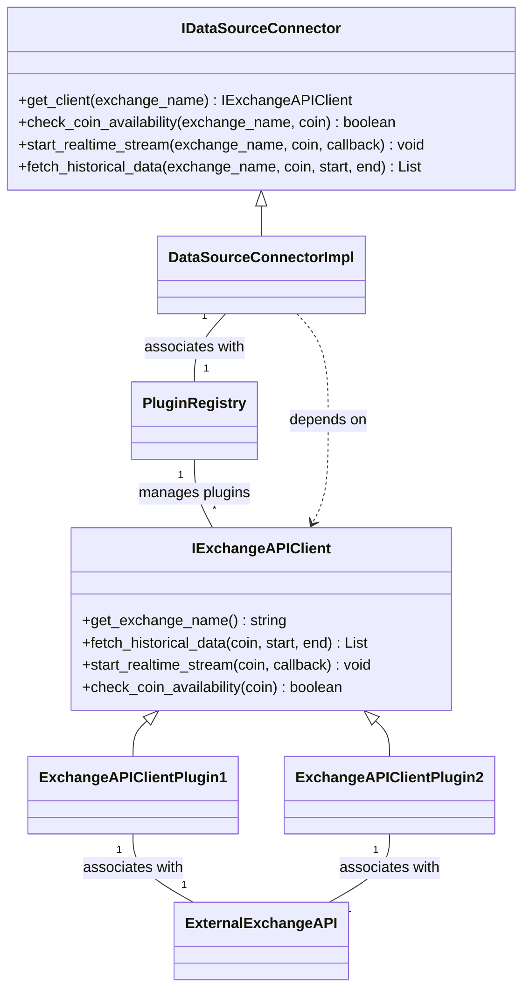
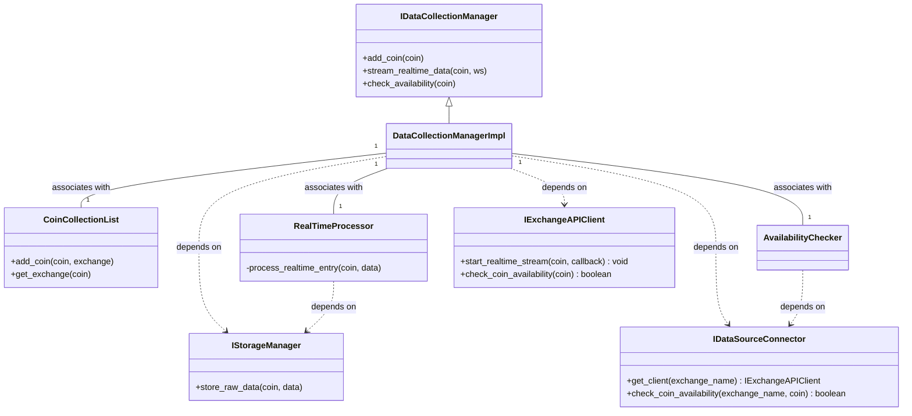
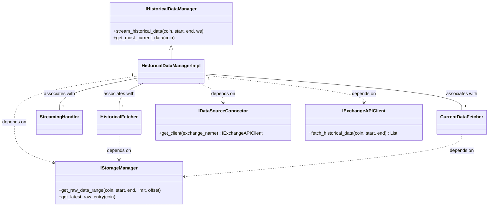
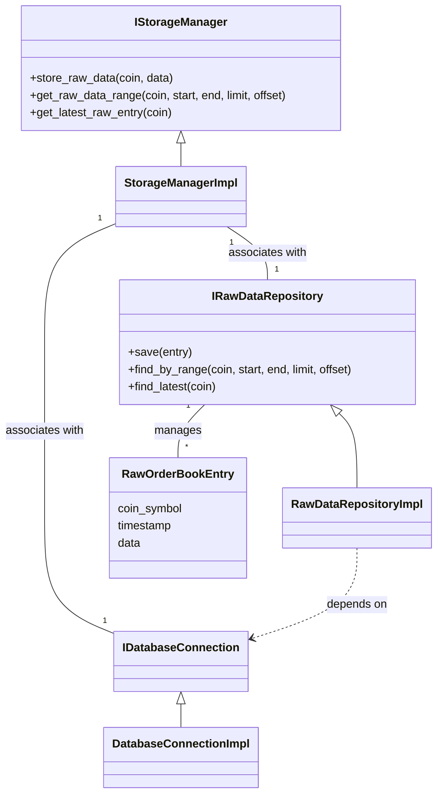
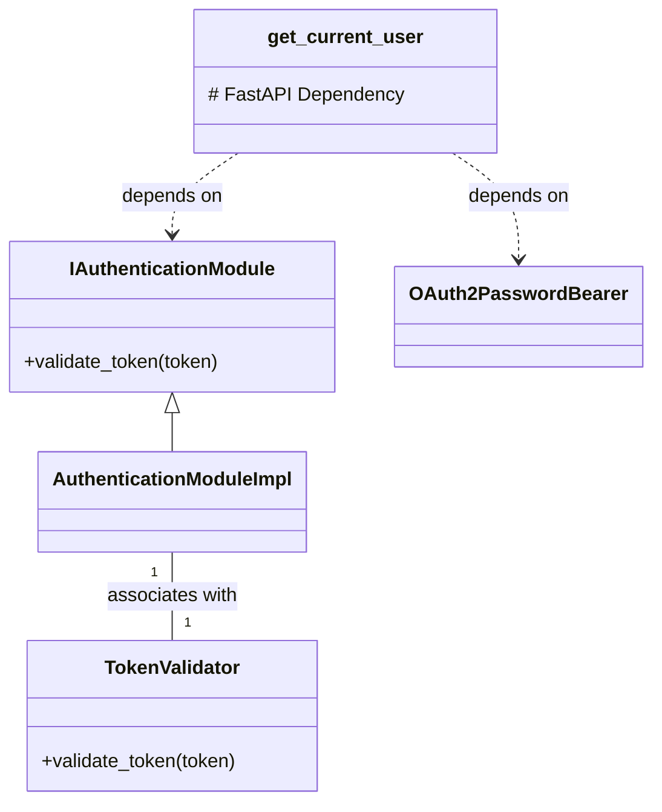
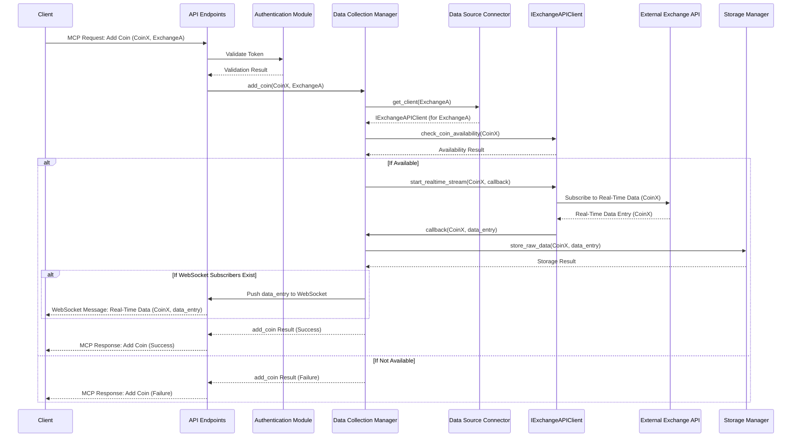
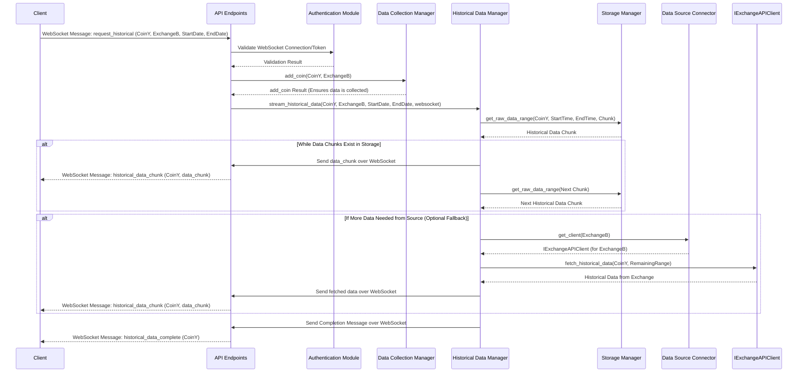

# Phase 1 Implementation Plan: Dedicated Data Service (UML)

This document provides a concrete implementation plan for the Data Service, the foundational component of your real-time adaptive crypto trading system. This service is responsible for all raw 5-minute order book data ingestion, storage, and distribution to other services (Build, Stage, Live).

The Data Service will be implemented using Python with FastAPI for the web framework, fastapi_mcp for Model Context Protocol (MCP) communication, WebSockets for streaming and real-time data, OAuth for authentication, and a centralized database for storage. All key components will be designed and implemented against interfaces or abstraction classes to ensure testability and maintainability. The Data Source Connector module will utilize a Microkernel plugin pattern to support multiple cryptocurrency exchanges.

---

## High-Level Module Dependency

**Module Descriptions:**
- **API Endpoints:** Handles incoming requests and WebSocket connections.
- **Data Collection Manager:** Manages the list of coins being collected and processes real-time data streams.
- **Historical Data Manager:** Handles requests for historical data.
- **Storage Manager:** Abstracts interactions with the raw data storage.
- **Authentication Module:** Validates incoming requests using OAuth.
- **Data Source Connector:** Implements the Microkernel, discovering and utilizing exchange plugins to handle low-level communication with external exchange APIs.
- **External Exchange API Plugins:** Concrete implementations for specific exchanges, adhering to a defined interface.
- **Centralized Raw Data Storage:** The persistent storage for raw data.

## Principle: Implementing Against Interfaces

To ensure testability and flexibility, concrete classes will implement interfaces or inherit from abstract base classes. Code that depends on a component will depend on its interface/abstraction, not the concrete implementation. This allows for easy substitution with mock objects during testing or alternative implementations in the future.

## Module Details and Implementation (UML Focus)

### API Endpoints Module

This module is the external interface of the Data Service, built using FastAPI. It defines the endpoints for MCP communication and manages WebSocket connections.

**Responsibilities:**
- Receive and route incoming MCP requests (Add Coin, Check Availability, Historical Data Download)
- Manage WebSocket connections for real-time data streams, historical data streaming, and "Most Current Data" requests
- Validate requests using the Authentication Module dependency (via its interface)
- Interact with the Data Collection Manager and Historical Data Manager dependencies (via their interfaces)

**Key Classes and Relationships:**

### Data Source Connector Module (Microkernel)

This module acts as the Microkernel, responsible for discovering and utilizing exchange-specific plugins to interact with external APIs.

**Plugin Interface (IExchangeAPIClient):**

**Key Classes and Relationships:**

### Data Collection Manager Module

This module manages the list of coins for which real-time data is being collected and processes the incoming real-time data stream.

### Historical Data Manager Module

This module handles requests for historical data and manages streaming it over WebSockets.

### Storage Manager Module

This module abstracts the interaction with the centralized raw data storage.

### Authentication Module

This module handles OAuth authentication for securing the Data Service's endpoints.

## Data Collection Workflow (Sequence Diagram)

## Historical Data Workflow (Sequence Diagram)

---

This detailed breakdown provides a concrete plan for implementing the Data Service using UML class diagrams and descriptions of relationships, emphasizing the use of interfaces for testability and maintainability and incorporating the Microkernel pattern for exchange connectors.
