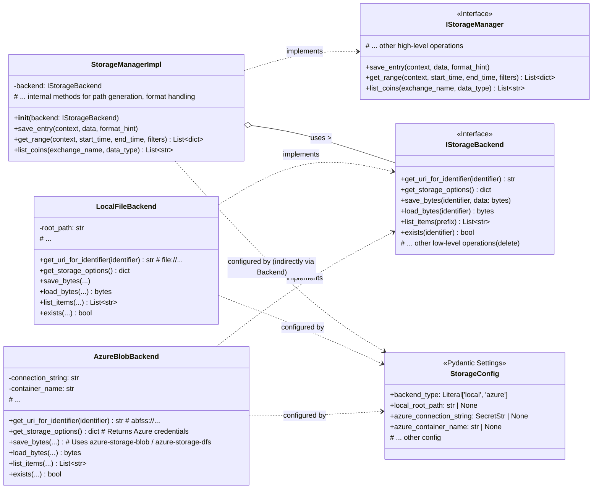
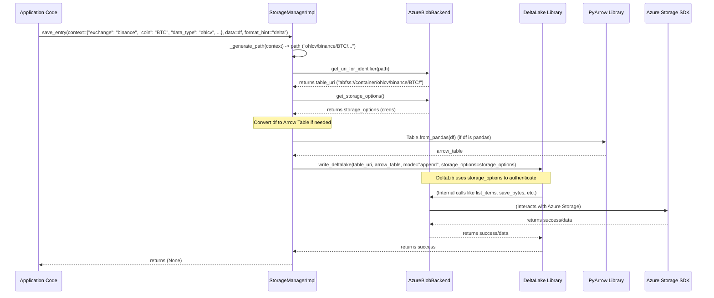

<!-- filepath: c:\Project\cyberbuild\cb-trade\cb-trade-data-service\.github\docs\storage.md -->
# Storage Package Documentation (Revised Design)

This document outlines the functionality and revised design of the storage package (`src/storage`) within the `cb-trade-data-service`.

## 1. `src/storage` Package (Data Storage)

### Purpose

The `src/storage` package provides a flexible system for persistent storage and retrieval of market data (e.g., OHLCV, trades, order books). It aims to abstract the underlying physical storage backend (local disk, Azure Blob/ADLS Gen2) and handle data serialization/deserialization for common formats (Parquet, JSON, Delta Lake).

### Design: Backend Abstraction and Manager Logic

The revised design simplifies the previous layered strategy pattern:

1.  **`IStorageBackend`**: Defines an interface for low-level, format-agnostic access to a specific physical storage medium (local files, Azure Blob/ADLS). It is responsible for translating logical identifiers (relative paths) into physical paths/URIs, managing necessary credentials/options, and performing basic byte-level operations (`save_bytes`, `load_bytes`, `list_items`).
2.  **`StorageManagerImpl`**: Implements the high-level `IStorageManager` interface. It contains the core logic for:
    *   Generating storage paths/identifiers based on domain context (exchange, coin, data type, timestamp).
    *   Handling data serialization/deserialization for different formats (Parquet, JSON, Delta Lake) using libraries like `pyarrow`, `pandas`, and `deltalake`.
    *   Orchestrating read/write operations by interacting with the configured `IStorageBackend`.
    *   Implementing efficient data retrieval and filtering (e.g., predicate pushdown for Delta Lake).

Configuration (e.g., backend type, connection details) is typically handled via dependency injection, often using a configuration object like Pydantic `BaseSettings`.

### Key Components

*   **`interfaces.py`**:
    *   `IStorageManager`: Defines the high-level facade interface for storage operations (`save_entry`, `get_range`, `list_coins`, etc.). Application code interacts primarily with this.
    *   `IStorageBackend`: Interface for physical storage access (byte operations, listing, URI generation, options).
        *   *Implementations:* `LocalFileBackend`, `AzureBlobBackend`.
*   **`backends/`**: Concrete `IStorageBackend` implementations (`local_file_backend.py`, `azure_blob_backend.py`).
*   **`storage_manager.py`**:
    *   `StorageManagerImpl`: Implements `IStorageManager`. It holds a configured instance of `IStorageBackend`. It contains the logic for path generation, format handling (using `pyarrow`, `pandas`, `deltalake`), and orchestrates operations with the backend.
*   **Configuration (`src/config.py`)**:
    *   `StorageConfig`: (Example) A Pydantic `BaseSettings` model. Reads environment variables or config files to determine which `IStorageBackend` implementation to instantiate and provides its necessary configuration (root paths, connection strings, container names). This configuration is used to inject the appropriate backend into `StorageManagerImpl`.

### Diagrams

#### Class Diagram (`src/storage` - Revised)

#### Sequence Diagram (Saving OHLCV Data with Delta/Azure)

## 2. `src/target_management` Package

*(This section remains unchanged unless the redesign impacts it directly)*

## Format Handling Notes

- The `StorageManagerImpl` is responsible for handling the conversion between in-memory representations (like Pandas DataFrames or PyArrow Tables) and the serialized format on disk (Parquet, JSON files, Delta Tables).
- It uses libraries like `pandas`, `pyarrow`, and `deltalake` for these conversions.
- The `save_entry` method typically accepts a DataFrame or Table and a `format_hint` (e.g., "parquet", "json", "delta").
- The `get_range` method reads data using the appropriate library based on the format (inferred or specified) and returns a list of dictionaries or a DataFrame.
- For Delta Lake, `write_deltalake` and `read_delta` (from the `deltalake` library) are used, leveraging the backend's `storage_options`.
- For Parquet, `pyarrow.parquet.write_table` and `pyarrow.parquet.read_table` (or `read_pandas`) are used, interacting with the backend's `save_bytes` and `load_bytes`.
- For JSON, `pandas.DataFrame.to_json` and `pandas.read_json` can be used with byte streams from the backend.

### Benefits of Revised Design
- Reduced complexity by removing intermediate strategy layers.
- Clear separation of concerns: Backend handles physical IO, Manager handles logic, paths, and formats.
- Easier configuration and setup using dependency injection for the backend.
- Flexibility to add new formats primarily by modifying the `StorageManagerImpl`.
